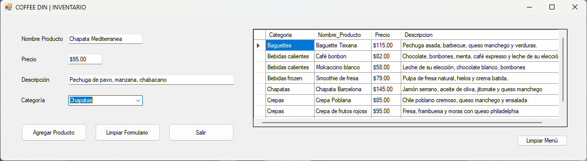

# CafeteriaInventario

**Materia:** Estructura de Datos
**Profesora:** Ing. Paula Daniela Muñoz Zárate
**Fecha:** 25 de abril del 2026

## Descripción
Este sistema permite el registro agil de productos que se ofrecen en una Cafetería. A través de éste se puede registrar el nombre del producto, el precio, y una pequeña descripción del mismo.

## Tecnologías Utilizadas
* C# (.NET Core / Framework)
* Base de Datos: [MySQL / SQL Server / etc.]
* Visual Studio 2022

## Instalación y Configuración
1. Clona el repositorio: `git clone [URL del repo]`
2. Abre el archivo `.sln` en Visual Studio.
3. Configura la cadena de conexión en el archivo `App.config` o `Web.config`.
4. Ejecuta el script de la base de datos incluido en la carpeta `/db`.

## Demostración

## Integrantes
* Ederid Ramos Braulio - 333000028
